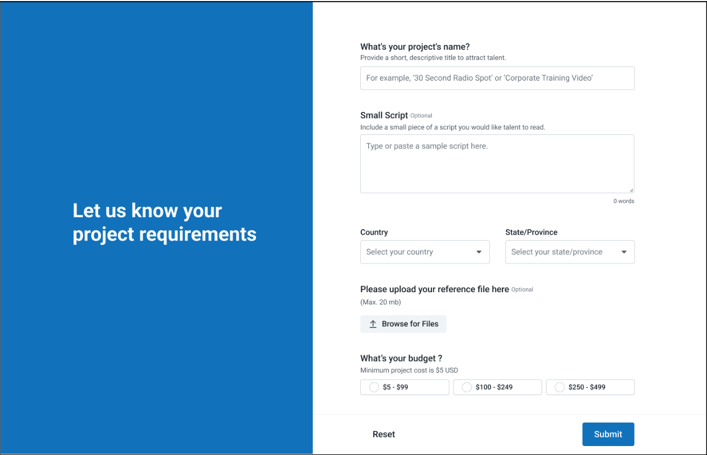
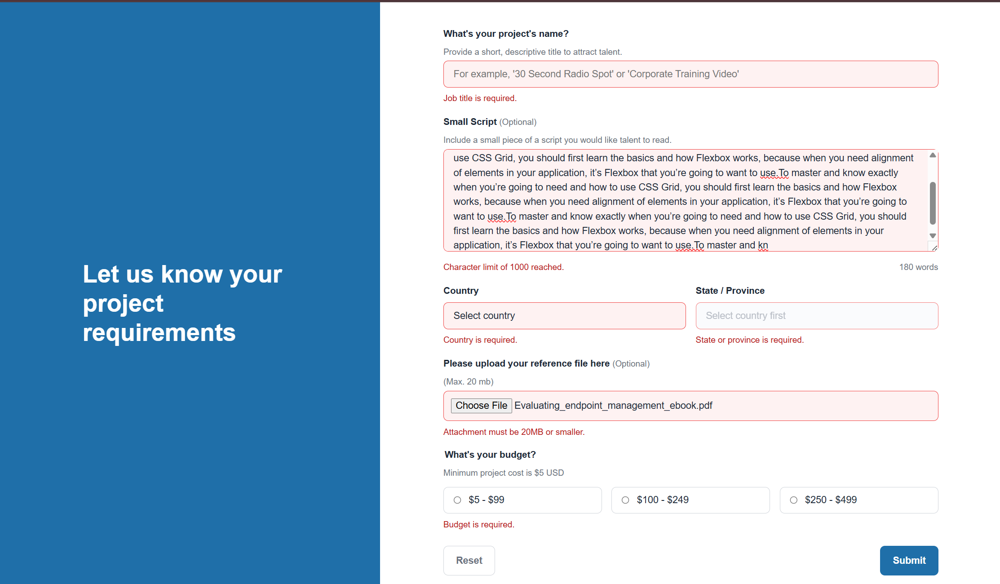
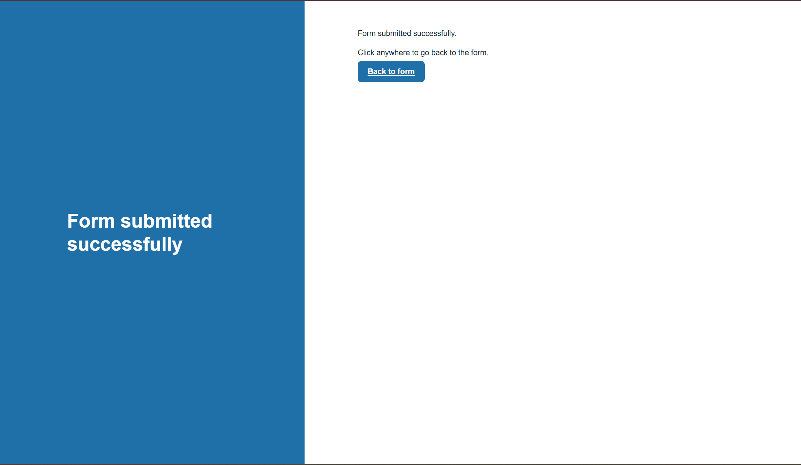

# jobForm-challenge

> **Note:** This README was written with AI assistance (GitHub Copilot). The contents of the `tests/` folder, `style-guide.md` were also generated by AI as part of a TDD workflow.

A framework-free MVC mini-application built with PHP, HTML, CSS, and vanilla JavaScript. It captures job submissions with server-side validation, CSRF protection, secure upload handling, and progressive enhancement.

## Intro

The form follows the UI direction in the `design/` folder and supports three key user states:

1. Default desktop form layout



2. Validation error state with inline feedback



3. Successful submission confirmation state



The implementation keeps a server-rendered baseline for reliability and accessibility, then adds JavaScript for dynamic country/state behavior, live word count, and client-side validation assistance.

---

## Quick Start

### Prerequisites
- Docker and Docker Compose

### 1. Configure environment

The `.env` file is excluded from version control via `.gitignore`. Set your database credentials there before starting:

```env
DB_HOST=db
DB_NAME=jobform
DB_USER=user
DB_PASSWORD=password
MYSQL_ROOT_PASSWORD=root
DB_PORT=3307
```

### 2. Start services

```bash
docker compose up --build -d
```

### 3. Database schema bootstrap

No manual command is needed on a fresh setup.

`docker compose up` mounts `migrations/20260411-create-submissions.sql` into MySQL's `/docker-entrypoint-initdb.d`, so the schema bootstrap runs automatically when the DB volume is created for the first time.

### 4. Open the app

```
http://localhost:8080
```

### 5. Connect using MySQL Workbench (optional)

Use these values from your host machine:

- Hostname: localhost
- Port: value of DB_PORT in your .env (default 3307)
- Username: value of DB_USER
- Password: value of DB_PASSWORD
- Default schema: value of DB_NAME

If you changed DB_PORT, restart containers with:

```bash
docker compose down
docker compose up -d --build
```

---

## Migration

SQL migration files are stored in `migrations/` using `yyyymmdd-name.sql` format.

### What is automatic?

- Automatic: the mounted bootstrap script runs once when MySQL initializes a brand-new data volume.
- Not automatic: scripts do not re-run on container restart if the DB volume already exists.

### How to run subsequent migrations

For changes after initial bootstrap, run SQL manually against the running DB container.

```bash
# Apply
make migrate-up FILE=migrations/20260412-add-some-change.sql

# Rollback
make migrate-down FILE=migrations/20260412-drop-some-change.sql
```

Direct Docker command alternative:

```bash
docker compose exec -T db sh -lc 'mysql -u"$MYSQL_USER" -p"$MYSQL_PASSWORD" "$MYSQL_DATABASE"' < migrations/20260412-add-some-change.sql
```

### Re-run all init scripts from scratch

If you want MySQL to re-run `/docker-entrypoint-initdb.d` scripts, recreate the DB volume:

```bash
docker compose down -v
docker compose up -d --build
```

Notes:
- Use `yyyymmdd-name.sql` naming (for example: `20260412-add-index-to-submissions.sql`).
- Keep `20260411-create-submissions.sql` as the bootstrap file mounted by Docker.
- Run later migrations manually with `make migrate-up FILE=...` / `make migrate-down FILE=...`.

---

## Testing

Tests are in `tests/` and use a native PHP test harness with no external framework.

> **Note:** All test files in `tests/` were written by AI (GitHub Copilot) as part of a TDD workflow. Tests were written first (red), then production code was written to satisfy them (green).

```bash
docker compose run --rm -v "$PWD":/app -w /app php php tests/run.php
```

Expected result: 9 passed, 1 intentionally failing. The failing test covers email sending, which is deferred and kept red deliberately to demonstrate the incomplete feature during review.

---

## Architecture

```
public/          Web root (Apache serves this)
  index.php      Front controller
  assets/
    css/form.css
    js/form.js
src/
  controllers/FormController.php        GET/POST routing, CSRF, orchestration
  models/Submission.php                 PDO insert
  views/form.php                        Server-rendered HTML form
  views/success.php                     Simple success page
  helpers/
    db/connection.php                   PDO bootstrap from environment
    mail/SubmissionMailer.php           Placeholder only, email deferred
    validation/SubmissionValidator.php  Server-side validation (source of truth)
data/regions.json    Country/state data, used by validator and JS
migrations/          Flat SQL migration files (yyyymmdd-name.sql)
tests/               Native PHP test suite (AI-generated)
storage/uploads/     File upload target (outside web root)
```

Pattern: Server-rendered MVC with progressive enhancement. The form works fully without JavaScript. JS adds realtime validation, live word count, and dependent country/state dropdowns.

---

## Security Measures

- CSRF protection: Token generated per session, verified on every POST
- Server-side validation: All fields validated in SubmissionValidator.php; client-side JS is UX only
- PDO prepared statements: All DB writes use parameterised queries
- Output escaping: PHP variables rendered via htmlspecialchars
- File upload hardening: Extension allowlist, MIME type verified server-side via finfo_file(), 20MB size cap, randomised stored filename
- Credentials via environment: .env is gitignored; no credentials in source
- Country/region validation: Server validates against regions.json, not client values

---

## Known Improvements / Deferred Items

- Email confirmation to jobform@voices.com: Placeholder only, SubmissionMailer.php exists but sends nothing
- Old input value re-population on error: Controller passes $old array to view; view bindings not yet wired
- Upload storage failures are surfaced as form errors while technical details are written to server logs

---

## Tradeoffs

- One DB table for submissions including nullable attachment metadata — avoids premature normalisation for a single optional file
- JSON for regions instead of a DB table — static data, no relational need, simpler
- No framework — matches assignment requirement, keeps the codebase explainable in an interview
- No migration framework — flat SQL files keep setup simple and interview-friendly
